# File: PWA/src/utils/api.ts

Typed wrappers over all backend API calls — single import for all screens.

```mermaid
flowchart TD
    A[api.ts] --> B[Auth]
    B --> B1["login(userId, password) → POST /auth/login"]
    B --> B2["logout() → DELETE /auth/logout"]

    A --> C[Home]
    C --> C1["getHomeDashboard() → GET /home"]

    A --> D[Reports]
    D --> D1["listReports(filters) → GET /reports/monthly"]
    D --> D2["getReport(month) → GET /reports/monthly/:month"]
    D --> D3["saveReport(data) → POST /reports/monthly {status:Draft}"]
    D --> D4["submitReport(data) → POST /reports/monthly {status:Submitted}"]
    D --> D5["downloadReportPDF(month) → GET /reports/monthly/:month/pdf"]

    A --> E[Distributions]
    E --> E1["getVaccines() → GET /admin/distributions/vaccines"]
    E --> E2["getVaccineStock() → GET /admin/distributions/vaccines/stock"]
    E --> E3["getReceivingInstitutes() → GET /admin/distributions/institutes"]
    E --> E4["issueVaccine(body) → POST /admin/distributions/vaccines/issue"]
    E --> E5["getVaccineReceipts() → GET /admin/distributions/vaccines/received"]
    E --> E6["getSemenTypes() → GET /admin/distributions/semen/types"]
    E --> E7["getSemenStock() → GET /admin/distributions/semen/stock"]
    E --> E8["issueSemen(body) → POST /admin/distributions/semen/issue"]
    E --> E9["getSemenReceipts() → GET /admin/distributions/semen/received"]

    A --> F[Notifications]
    F --> F1["listNotifications(filters) → GET /notifications"]
    F --> F2["markRead(id) → PATCH /notifications/:id/read"]
    F --> F3["markAllRead() → POST /notifications/mark-all-read"]

    A --> G[Geo]
    G --> G1["getDistricts() → GET /geo/districts"]
    G --> G2["getTehsils(distId) → GET /geo/tehsils?districtId="]
    G --> G3["getVillages(tehsilId) → GET /geo/villages?tehsilId="]
```

**Pattern:** Every function calls `apiClient.fetch()` and parses JSON. Errors are thrown with the backend `message` field.

**File:** `PWA/src/utils/api.ts`
