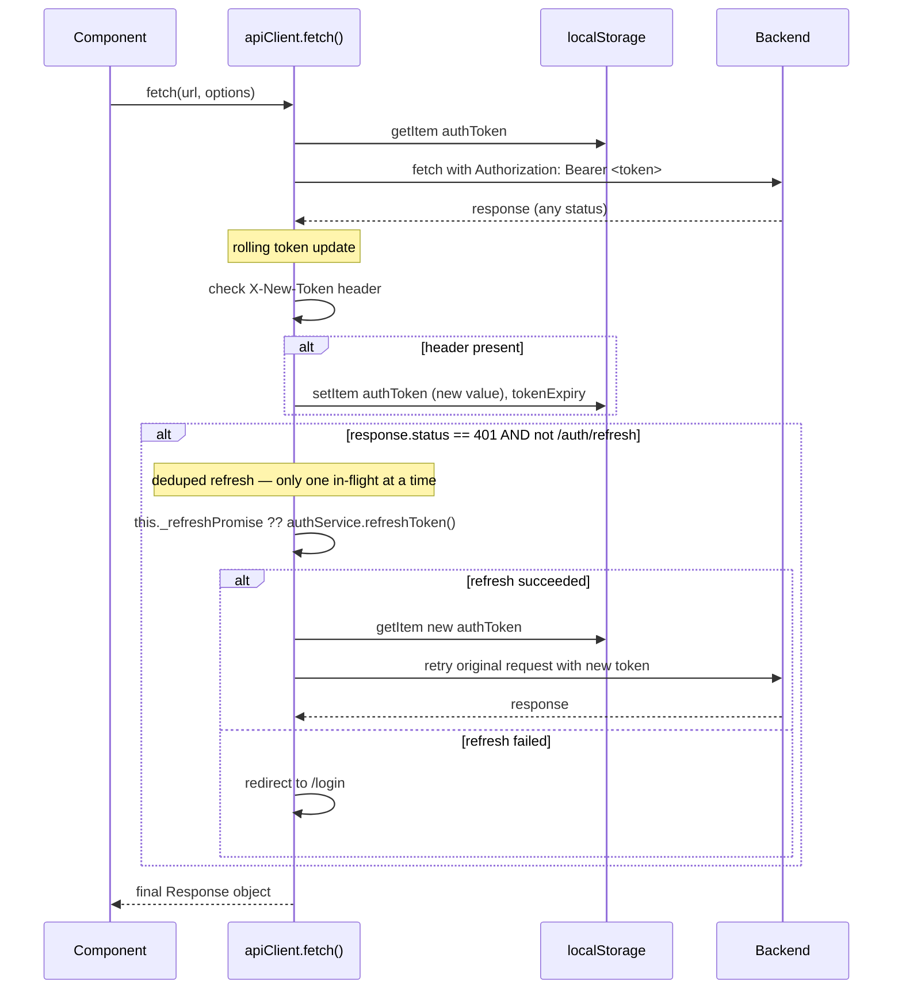

# File: PWA/src/utils/apiClient.ts

Fetch wrapper — auto-attaches JWT, saves rolling token, retries on 401.

**Dedup logic:** `_refreshPromise` is set on the first 401 and cleared when resolved. Concurrent requests all await the same promise — no race condition.

**File:** `PWA/src/utils/apiClient.ts`
