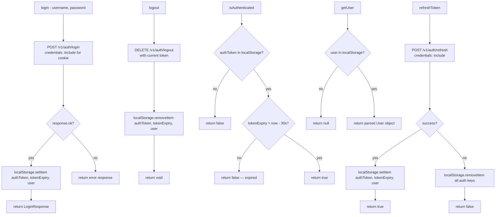

# File: ahpunjabfrontend/src/services/authService.ts

Authentication state manager — token storage, login, logout, user retrieval.

**Token strategy:**
- Access token: localStorage, 15-minute expiry, refreshed by `apiClient.ts` on 401
- Refresh token: HttpOnly cookie (never accessible from JS), 7-day rolling

**File:** `ahpunjabfrontend/src/services/authService.ts`
