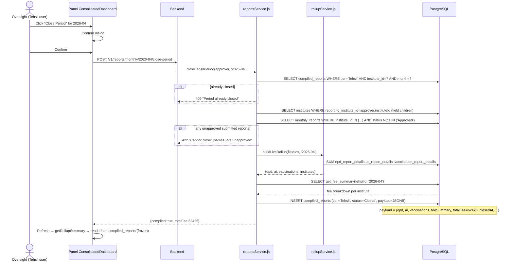

# Flow: Tehsil Close Period → Frozen Compile

**Why this matters:** After close, `getRollupSummary` will ALWAYS return the frozen payload — never live SUM. This matches the physical paper workflow where the Tehsil locks in the month's numbers and sends them up to District.

**Regression anchor:** Talwandi Sabo Tehsil, April 2026 → `totalFee = ₹62,425` (verified in Phase 1).

**Key files:**
- `Backend/src/services/reportsService.js` — `closeTehsilPeriod` (line ~1612)
- `Backend/src/services/rollupService.js` — `buildLiveRollup`, `getRollupSummary`
- `Database/schema.sql` — `compiled_reports` table (section 33), `get_fee_summary` function (section 31)
