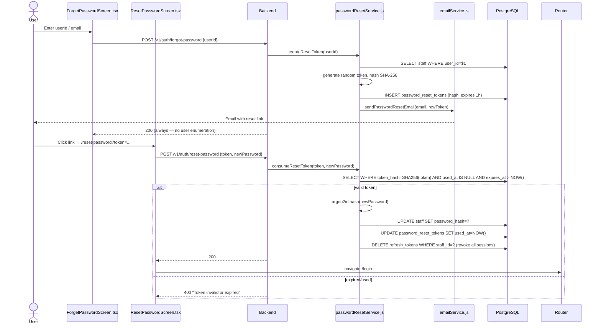

# Flow: Forgot Password → Reset

**Key files:**
- `ahpunjabfrontend/src/screens/ForgetPasswordScreen.tsx`, `ResetPasswordScreen.tsx`
- `Backend/src/services/passwordResetService.js`
- `Backend/src/services/emailService.js`
- `Backend/src/routes/auth.js`
- `Database/schema.sql` — `password_reset_tokens` table (section 28)
