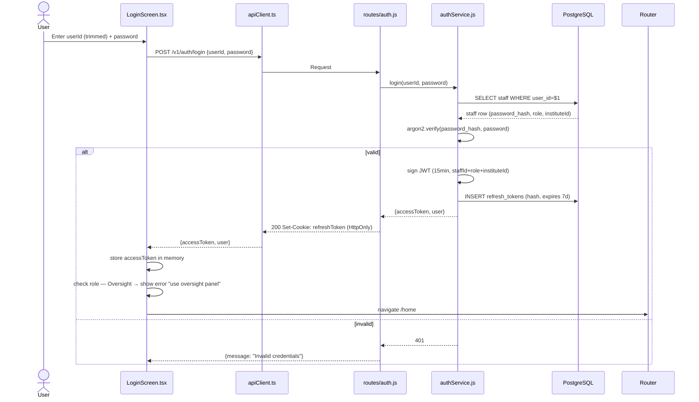
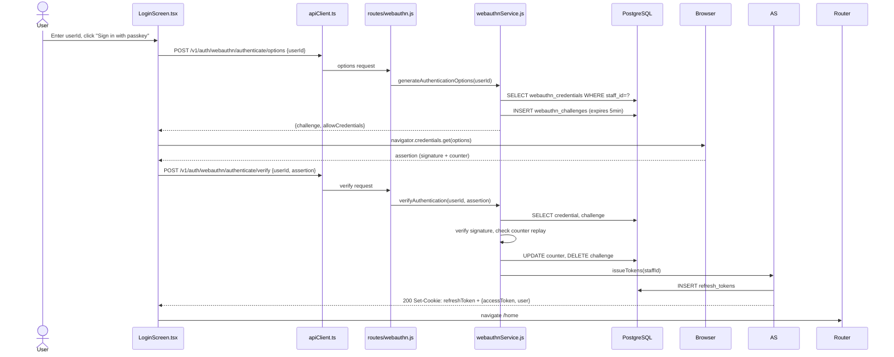

# Flow: Login (Password + WebAuthn)

## Password Login

## WebAuthn Passkey Login

**Key files:**
- `PWA/src/screens/LoginScreen.tsx` — username trim at all 4 call sites, Oversight block
- `Backend/src/services/authService.js` — argon2id verify, JWT sign
- `Backend/src/services/webauthnService.js` — FIDO2 challenge/verify
- `Backend/src/routes/auth.js`, `routes/webauthn.js`
