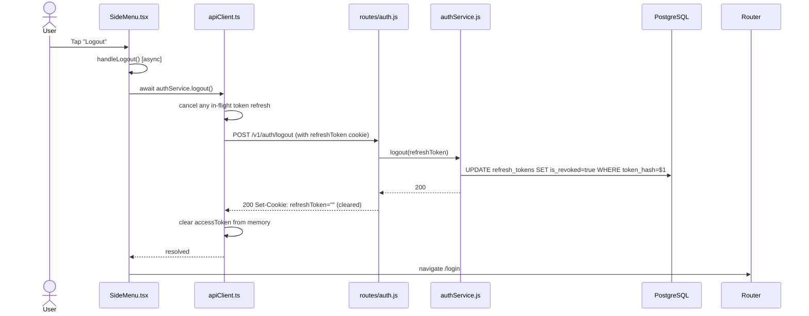

# Flow: Logout

**Why async matters:** Before this fix, `handleLogout` returned without awaiting. The logout POST would race against a background token refresh — the refresh could re-write the accessToken after logout cleared it, leaving a valid session open. Now logout awaits the POST before navigating.

**Key files:**
- `PWA/src/components/SideMenu.tsx` — `handleLogout` is `async`, `await authService.logout()`
- `PWA/src/services/authService.ts` — `logout()` cancels refresh, POSTs logout
- `Backend/src/services/authService.js` — revokes refresh token in DB
- `Backend/src/services/refreshTokenService.js` — `revokeToken()`
