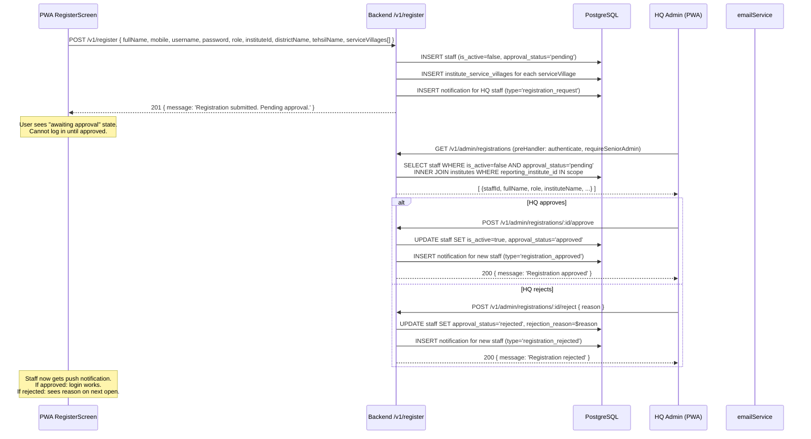

# Flow: New User Registration → HQ Approval

New field staff self-register through the PWA. The account is inactive until a Senior Admin (HQ_Admin or Super_Admin) approves it. Field staff cannot log in until approved.

**Key rules:**
- Registration scope: HQ only sees pending registrations where the new institute's `reporting_institute_id` falls within their oversight scope.
- `is_active = false` blocks JWT issuance — `authService.login` checks `is_active` before issuing tokens.
- Service villages are linked in `institute_service_villages`; their population data drives AI coverage metrics.
