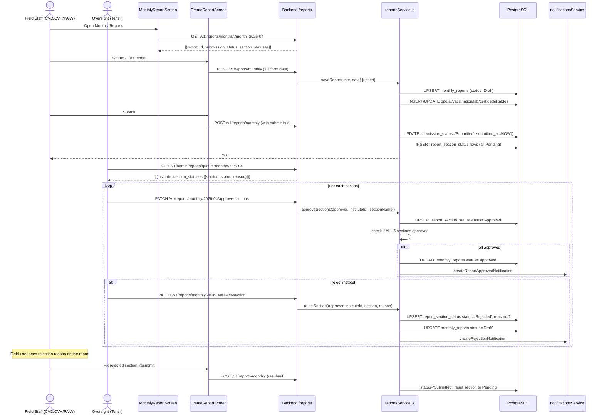

# Flow: Monthly Report Lifecycle

**Key files:**
- `PWA/src/screens/MonthlyReportScreen.tsx` — lists reports with section status dots
- `PWA/src/screens/CreateReportScreen.tsx` — multi-section form
- `Backend/src/services/reportsService.js` — `saveReport`, `approveSections`, `rejectSection`
- `Backend/src/routes/reports.js` — `requireFieldRole` guard on POST, `requireAdminRole` on PATCH
- `Database/schema.sql` — `monthly_reports`, `report_section_status` (sections 10, 32)
