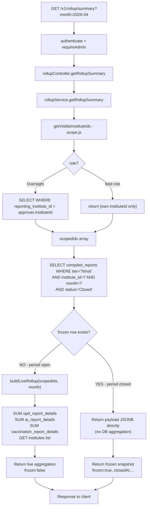

# Flow: Rollup Summary Read (Live vs Frozen)

**Key files:**
- `Backend/src/services/rollupService.js` — `getRollupSummary` (checks `compiled_reports` first), `buildLiveRollup`
- `Backend/src/utils/scope.js` — `getVisibleInstituteIds`
- `Backend/src/routes/rollup.js` — `requireAdmin` guard (Oversight only)
- `Database/schema.sql` — `compiled_reports` (section 33)

**Inconsistency flagged (do not fix here):** The panel's `ConsolidatedDashboardScreen.tsx` reads `aiSummary`/`opdSummary`/`vaccinationSummary` but the API returns `ai`/`opd`/`vaccinations`. Panel tables will be empty until this key mismatch is fixed.
