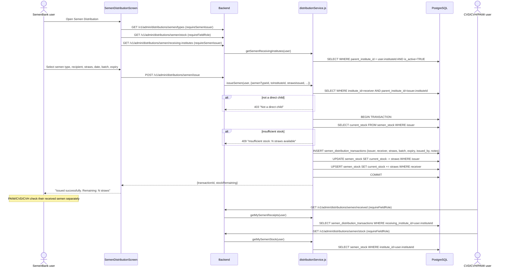

# Flow: Semen Issuance (SemenBank → PAIW/CVD/CVH)

**Key files:**
- `ahpunjabfrontend/src/screens/SemenDistributionScreen.tsx` — SemenBank issue form
- `ahpunjabfrontend/src/screens/SemenLedgerScreen.tsx` — Field user receipts + balance
- `Backend/src/services/distributionService.js` — `issueSemen`, `getMySemenReceipts`, `getMySemenStock`
- `Backend/src/routes/distributions.js` — `requireSemenIssuer=['SemenBank']`, `requireFieldRole` for stock/received
- `Database/schema.sql` — `semen_distribution_transactions`, `semen_stock` (sections 8, 34)
