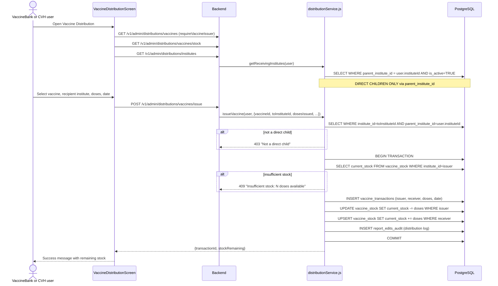

# Flow: Vaccine Issuance (VaccineBank → CVH or CVH → CVD)

**Key files:**
- `ahpunjabfrontend/src/screens/VaccineDistributionScreen.tsx`
- `Backend/src/services/distributionService.js` — `issueVaccine`, `getReceivingInstitutes`
- `Backend/src/routes/distributions.js` — `requireVaccineIssuer = ['VaccineBank', 'CVH']`
- `Database/schema.sql` — `vaccine_transactions`, `vaccine_stock` (sections 9)
