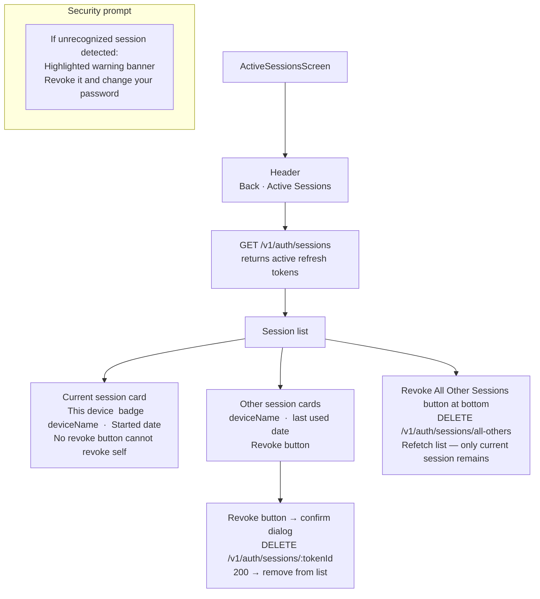

# UI: Active Sessions Screen

View and revoke active login sessions across all devices.

**Linked from:** ProfileScreen → Security section.

**Device identification:** `deviceName` is parsed from the User-Agent at login time: browser + OS (e.g., "Chrome on iPhone", "Safari on Mac").
