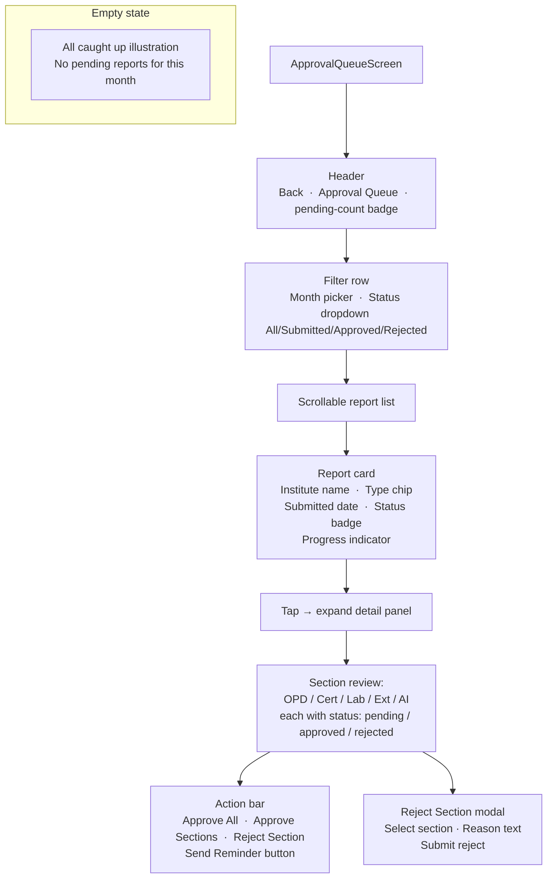

# UI: Approval Queue Screen

Admin-only. Lists submitted reports for the admin's oversight scope.

**API calls:** `GET /v1/admin/reports/queue`, `PATCH /v1/admin/reports/monthly/:month/approve`, `PATCH .../approve-sections`, `PATCH .../reject-section`, `POST /v1/admin/remind`.
