# UI: Create Report Screen

Multi-section monthly report form — OPD, AI, Vaccination, Camp, Lab, Certificates.

```mermaid
graph TD
    A[CreateReportScreen] --> B[ScreenHeader with back]
    A --> C[Section tab bar]

    C --> D[OPD Tab]
    D --> D1[Equines: new / old / beneficiaries]
    D --> D2[Bovine]
    D --> D3[Small Animals]
    D --> D4[Dogs and Cats]
    D --> D5[Gaushala]
    D --> D6[Poultry / Pets]

    C --> E[AI Report Tab]
    E --> E1[Local Semen: HF / Jersey / CB / Sahiwal]
    E --> E2[Gir Semen]
    E --> E3[ETT / Imported]
    E --> E4[Sexed Semen]
    E --> E5[Buffaloes]

    C --> F[Vaccination Tab]
    F --> F1[Disease / Vaccine type / doses]

    C --> G[Camp Tab]
    G --> G1[Farmer awareness camps]
    G --> G2[School lectures]
    G --> G3[Farmer training]
    G --> G4[Campaigns]

    C --> H[Lab Tab]
    H --> H1[Blood / Milk / Fecal / Urine / X-ray / Ultrasound / Other]

    C --> I[Certificates Tab]
    I --> I1[Health certificates]
    I --> I2[Post-mortem]
    I --> I3[Vetro-legal]

    A --> J[Bottom bar]
    J --> J1[Save Draft button → POST /reports/monthly status=Draft]
    J --> J2[Submit button → POST /reports/monthly status=Submitted]
```

**Auto-load:** If `?month=` param exists, fetches `GET /v1/reports/monthly/:month` and populates all fields.
