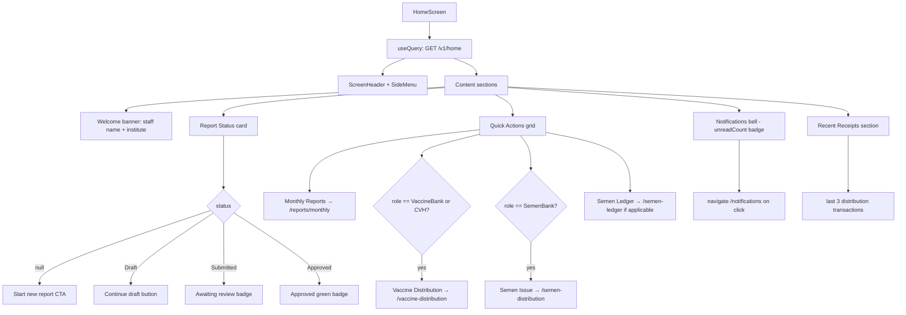

# UI: Home Screen

Main dashboard — role-aware sections.

```mermaid
graph TD
    A[HomeScreen] --> B["useQuery: GET /v1/home"]
    B --> C[ScreenHeader + SideMenu]
    B --> D[Content sections]

    D --> E[Welcome banner: staff name + institute]

    D --> F[Report Status card]
    F --> F1{status}
    F1 -->|null| F2[Start new report CTA]
    F1 -->|Draft| F3[Continue draft button]
    F1 -->|Submitted| F4[Awaiting review badge]
    F1 -->|Approved| F5[Approved green badge]

    D --> G[Quick Actions grid]
    G --> G1[Monthly Reports → /reports/monthly]
    G --> G2{role == VaccineBank or CVH?}
    G2 -->|yes| G3[Vaccine Distribution → /vaccine-distribution]
    G --> G4{role == SemenBank?}
    G4 -->|yes| G5[Semen Issue → /semen-distribution]
    G --> G6[Semen Ledger → /semen-ledger if applicable]

    D --> H[Notifications bell - unreadCount badge]
    H --> H1[navigate /notifications on click]

    D --> I[Recent Receipts section]
    I --> I1[last 3 distribution transactions]
```

**API call:** `GET /v1/home` — returns reportStatus, unreadCount, recentReceipts, institute info
