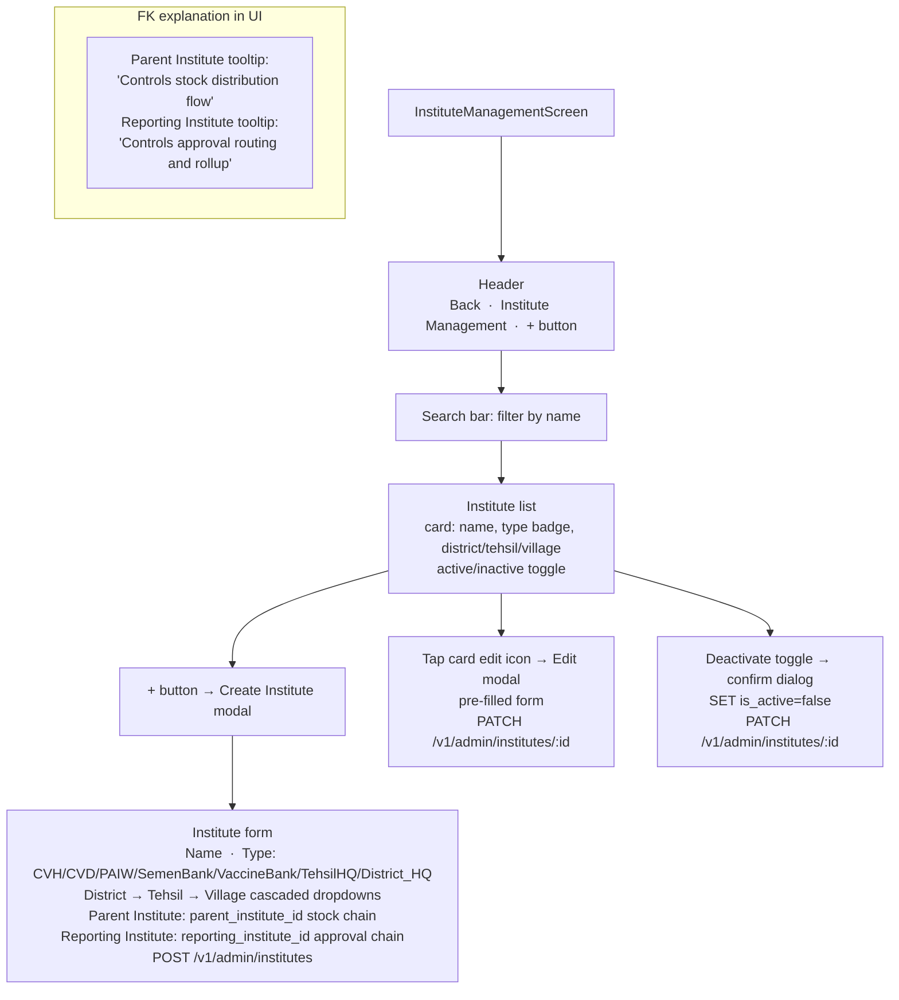

# UI: Institute Management Screen

Admin screen for creating, editing, and deactivating institutes.

**API calls:** `GET /v1/admin/institutes`, `POST /v1/admin/institutes`, `PATCH /v1/admin/institutes/:id`, `GET /v1/geo/eligible-parents?district=&tehsil=&type=`.
