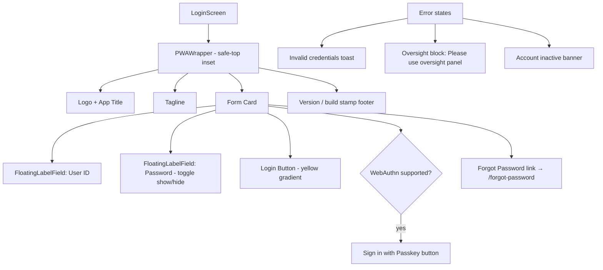

# UI: Login Screen

**API calls:** `POST /v1/auth/login`, `POST /v1/auth/webauthn/authenticate-options` + `POST /v1/auth/webauthn/authenticate`

**Roles:** Public (blocks Oversight after successful auth)

**Layout:** Fits entirely on one screen without scrolling (no scroll container needed)
