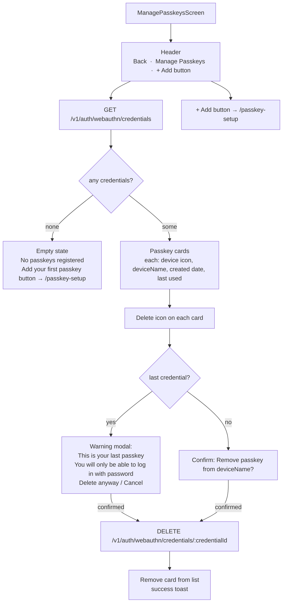

# UI: Manage Passkeys Screen

View and revoke WebAuthn credentials.

```mermaid
flowchart TD
    A[ManagePasskeysScreen] --> H[Header\nBack  ·  Manage Passkeys  ·  + Add button]

    H --> LOAD[GET /v1/auth/webauthn/credentials]

    LOAD --> LIST{any credentials?}
    LIST -->|none| EMPTY[Empty state\nNo passkeys registered\nAdd your first passkey button → /passkey-setup]
    LIST -->|some| CARDS[Passkey cards\neach: device icon, deviceName, created date, last used]

    CARDS --> DEL[Delete icon on each card]
    DEL --> CONFIRM{last credential?}
    CONFIRM -->|yes| WARN[Warning modal:\nThis is your last passkey\nYou will only be able to log in with password\nDelete anyway / Cancel]
    CONFIRM -->|no| PLAIN[Confirm: Remove passkey from deviceName?]

    WARN & PLAIN -->|confirmed| API[DELETE /v1/auth/webauthn/credentials/:credentialId]
    API --> OK[Remove card from list\nsuccess toast]

    H --> ADD[+ Add button → /passkey-setup]
```

**Linked from:** ProfileScreen → Security section.
