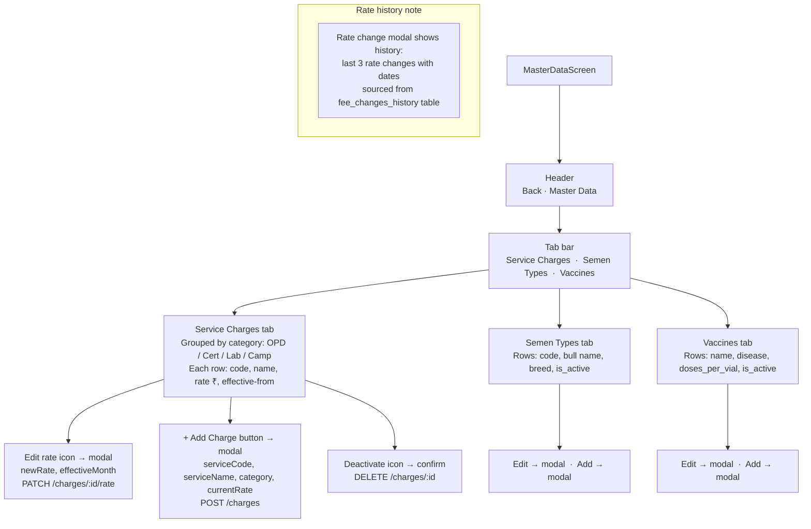

# UI: Master Data Screen

HQ Admin reference-data management: service charges, semen types, vaccines.

**API calls:** All at `/v1/admin/master-data/charges`, `/semen-types`, `/vaccines` — GET list, POST create, PATCH update, DELETE deactivate.
