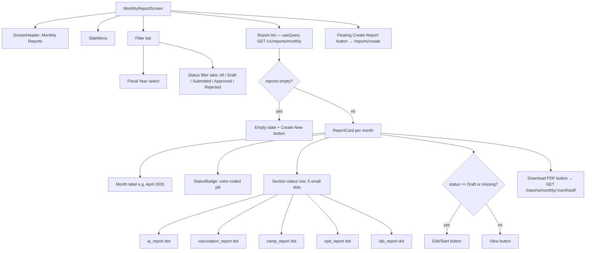

# UI: Monthly Report Screen

Report list with fiscal year filter and section-level status dots.

```mermaid
graph TD
    A[MonthlyReportScreen] --> B[ScreenHeader: Monthly Reports]
    A --> C[SideMenu]

    A --> D[Filter bar]
    D --> D1[Fiscal Year select]
    D --> D2[Status filter tabs: All / Draft / Submitted / Approved / Rejected]

    A --> E["Report list — useQuery GET /v1/reports/monthly"]

    E --> F{reports empty?}
    F -->|yes| G[Empty state + Create New button]
    F -->|no| H[ReportCard per month]

    H --> I[Month label e.g. April 2026]
    H --> J[StatusBadge: color-coded pill]
    H --> K[Section status row: 5 small dots]
    K --> K1[ai_report dot]
    K --> K2[vaccination_report dot]
    K --> K3[camp_report dot]
    K --> K4[opd_report dot]
    K --> K5[lab_report dot]

    H --> L{status == Draft or missing?}
    L -->|yes| M[Edit/Start button]
    L -->|no| N[View button]

    H --> O[Download PDF button → GET /reports/monthly/:month/pdf]

    A --> P[Floating Create Report button → /reports/create]
```

**Section dot colors:** green=Approved, red=Rejected, yellow=Pending, gray=not yet evaluated
