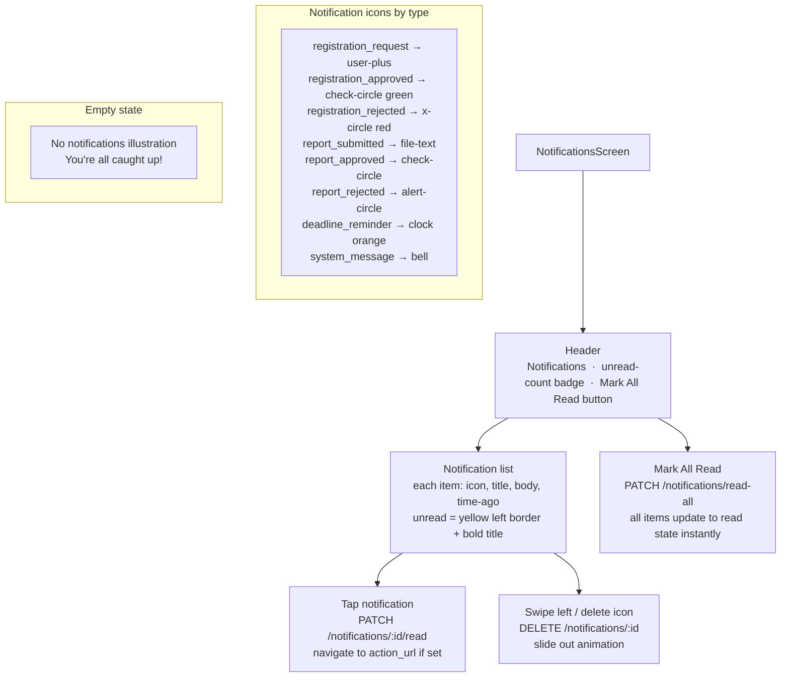

# UI: Notifications Screen

In-app notification inbox.

**API calls:** `GET /v1/notifications?limit=30`, `PATCH /v1/notifications/:id/read`, `PATCH /v1/notifications/read-all`, `DELETE /v1/notifications/:id`.
