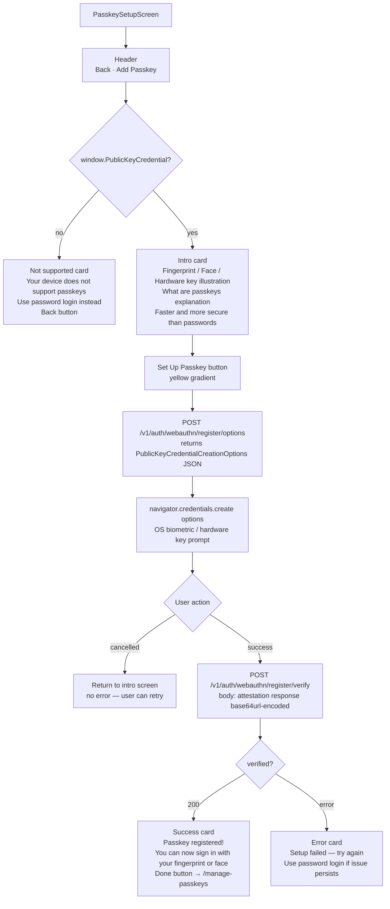

# UI: Passkey Setup Screen

Guides user through registering a new WebAuthn passkey.

**Technical note:** ArrayBuffers in the `PublicKeyCredential` response are converted to Base64url strings before JSON serialization for transmission to the server.
