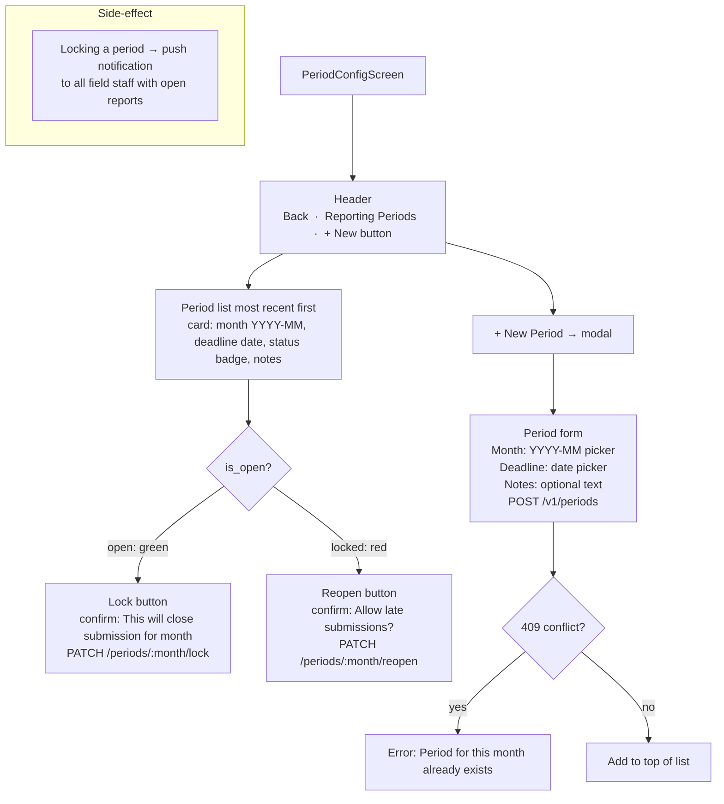

# UI: Period Config Screen

HQ Admin controls which reporting months are open for submission.

**API calls:** `GET /v1/periods`, `POST /v1/periods`, `PATCH /v1/periods/:month/lock`, `PATCH /v1/periods/:month/reopen`.
