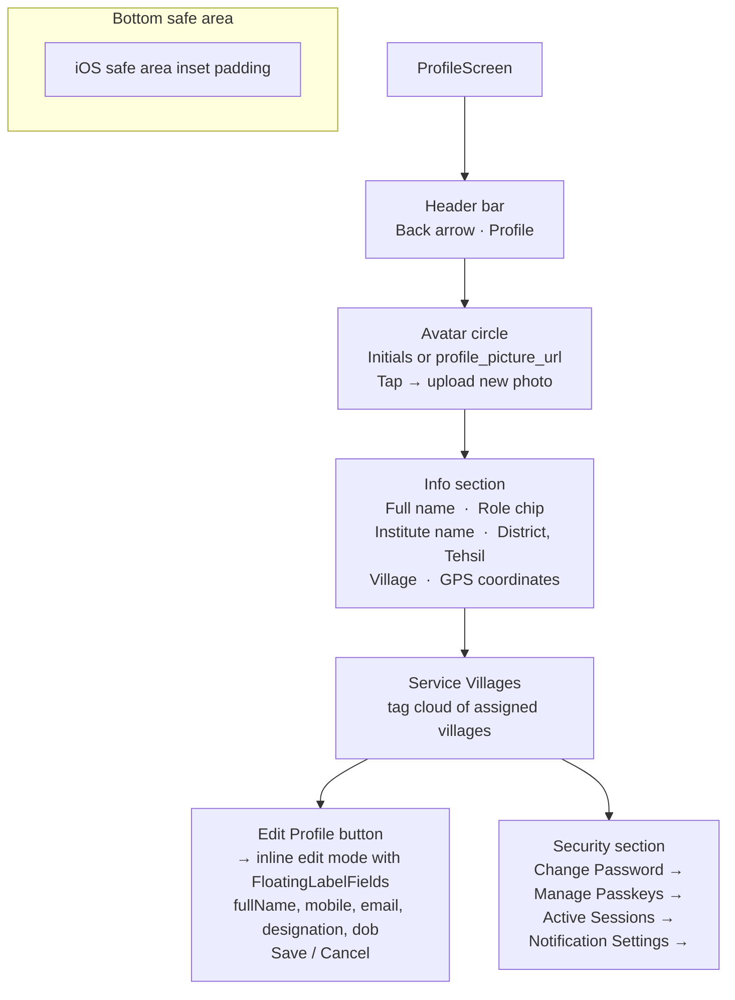

# UI: Profile Screen

**API calls:** `GET /v1/profile` on load; `PATCH /v1/profile` on save; `POST /v1/profile/picture` on photo tap.

**Layout:** `flex flex-col h-screen overflow-hidden` — scrollable content area between fixed header and fixed save button.
