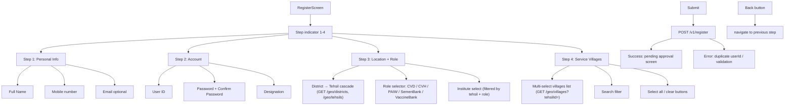

# UI: Register Screen

Multi-step registration wizard.

```mermaid
graph TD
    A[RegisterScreen] --> B[Step indicator 1-4]

    B --> C[Step 1: Personal Info]
    C --> C1[Full Name]
    C --> C2[Mobile number]
    C --> C3[Email optional]

    B --> D[Step 2: Account]
    D --> D1[User ID]
    D --> D2[Password + Confirm Password]
    D --> D3[Designation]

    B --> E[Step 3: Location + Role]
    E --> E1["District → Tehsil cascade (GET /geo/districts, /geo/tehsils)"]
    E --> E2["Role selector: CVD / CVH / PAIW / SemenBank / VaccineBank"]
    E --> E3["Institute select (filtered by tehsil + role)"]

    B --> F[Step 4: Service Villages]
    F --> F1["Multi-select villages list (GET /geo/villages?tehsilId=)"]
    F --> F2[Search filter]
    F --> F3[Select all / clear buttons]

    G[Submit] --> G1["POST /v1/register"]
    G1 --> G2[Success: pending approval screen]
    G1 --> G3[Error: duplicate userId / validation]

    H[Back button] --> H1[navigate to previous step]
```

**Note:** Registration creates a `registration_request` record. No login access until an Oversight user approves it.
