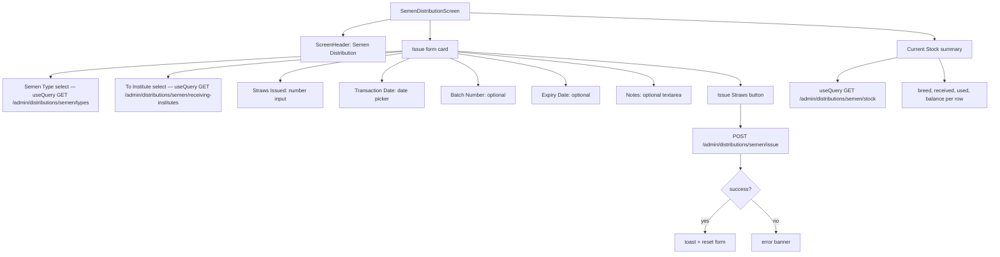

# UI: Semen Distribution Screen

Issue semen straws to a direct-child institute (SemenBank role only).

**Only SemenBank role can issue.** The backend `requireSemenIssuer` guard enforces this even if the client is tampered with.
