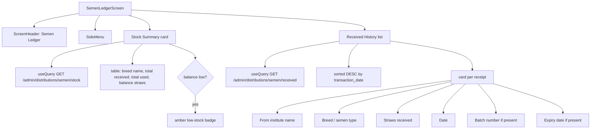

# UI: Semen Ledger Screen

Received semen history and running stock balance.

**Roles:** All FIELD_ROLES can view their own receipts. SemenBank sees both issues made (as the issuer) and incoming straws (if they also receive from a higher-level SemenBank).
