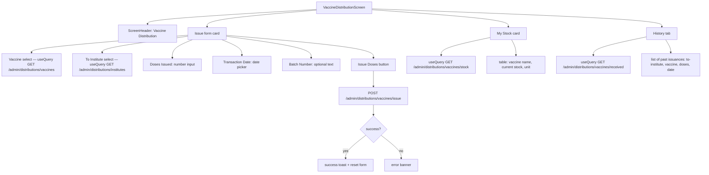

# UI: Vaccine Distribution Screen

Issue vaccine doses to direct-child institutes (VaccineBank + CVH roles).

**Guard:** Only `VaccineBank` and `CVH` can see this screen. App.tsx wraps in ProtectedRoute and SideMenu only shows link for these roles.
